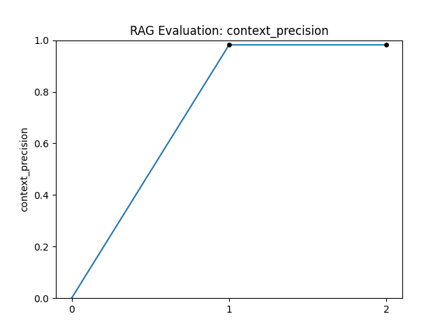
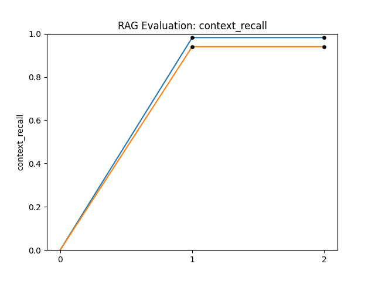

**Table of Contents**
1. [Agent Evaluation](#agent-evaluation)
2. [RAG Evaluation](#rag-evaluation)
   1. [Introduction](#introduction)
   2. [Results](#results)
      3. [Context Precision](#context-precision)
      4. [Context Recall](#context-recall)

# Agent Evaluation

**TODO**

# RAG Evaluation

## Introduction

Our objective is to monitor and improve the RAG pipeline for **AI-OPS**, that requires context-specific data from 
*Cybersecurity* and *Penetration Testing* fields; also we want the evaluation process to be as automated as possible.

The evaluation workflow is split in two steps:

1. **Dataset Generation** ([dataset_generation.ipynb](./test/benchmarks/rag/dataset_generation.ipynb)):
uses Ollama and the data that is ingested into Qdrant (RAG Vector Database) to generate *question* and *ground truth* 
 (Q&A dataset).

2. **Evaluation** ([evaluation.py](./test/benchmarks/rag/evaluation.py)):
builds the RAG pipeline with the same used to generate the synthetic Q&A dataset, leverages the pipeline to provide
 an *answer* to the questions (given *contex*), then performs evaluation of the full evaluation dataset using LLM as a
judge; for performance reasons the evaluation is performed using HuggingFace Inference API.

## Results

### Context Precision

**TODO:** *describe the metric and the prompts used* 

### Context Recall

**TODO:** *describe the metric and the prompts used* 

