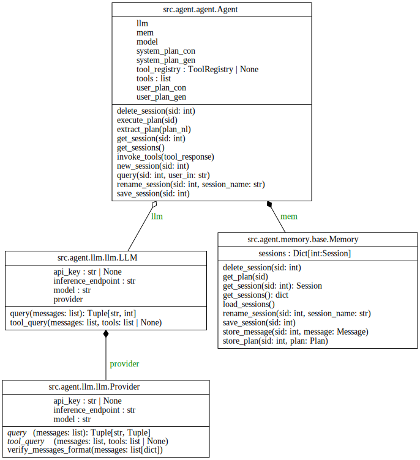

**Table of Contents**
...

## General

### Plan Removal

`Plan` class was originally made to have a structured way to represent and execute a certain number of 
tasks (represented by `Task` object); each task is in a 1-to-1 relationship with `Tool`. The issue is 
that not knowing what will be the actual agent architecture (see [section 2](#2-agent-class-refactoring))
makes it impossible to define how the agent(/assistant) will operate. 

To achieve better *codebase maintainability* the decision taken is to "purge" everything that references
the `Plan` class.

### Tool Removal

Currently, the tool functionality tries to include hacking tools independently. SLMs "overfit" on those tools
if they are provided directly; also including those tools manually involves maintenance and generation of a 
"good" documentation to provide to the LLM. 

This problem can be solved by relying on the knowledge of LLMs about a specific tool and on the online search
functionality / terminal usage functionality to make the Assistant use tools; for this reason the following 
items will be removed:
- `src.agent.tools.base.Tool`
- `tool_settings/`
- `scripts/gen_tool_guidelines.py`
- `test/unit/tools/test_base_tool.py`
- The code in `src.agent.tools.__init__.py` that creates the `.aiops/tools` directory.

### Merge knowledge.nlp in knowledge.store

The module `src.agent.knowledge.nlp` contains `chunk` function that is only used inside the `Store` 
object (responsible for Vector Database interaction). Given that, currently, there is no need to keep
those separated, the decision taken is to put `chunk` function inside `store` module.
> Note: in the future experimentation with chunking strategies may be done, however this shouldn't 
> represent any issue with this decision.

# Agent Class Refactoring

## Context and Problem Statement

AI-OPS is still an experimental project, the `Agent` class (core of the app) need to be easy to change; the 
design of the class needs to be flexible and delegate as much as possible to other components. As can
be seen below the `LLM` is injected into it, that is good, however the `Memory` component is accessed
through `Agent` class that acts as a *Facade* for memory access.

So the problem is identifying a design that (a) delegate the memory management to other components (b) makes
easy to replace the generation strategy and the underlying architecture of the agent.

### Decision Drivers

* Frequent changes to agent underlying architecture.

### Considered Options

* Builder
* Strategy

## Decision Outcome

Chosen option: **Strategy Design Pattern**, because it solves the problem (b), making `Agent` just an interface 
that defines a behaviour (ex. `query`).  

### Consequences

Pros:
* Isolate agent architectural details from the rest of the code.
* Follows *Open/Closed Principle*, allowing experiments with new architectures. 

